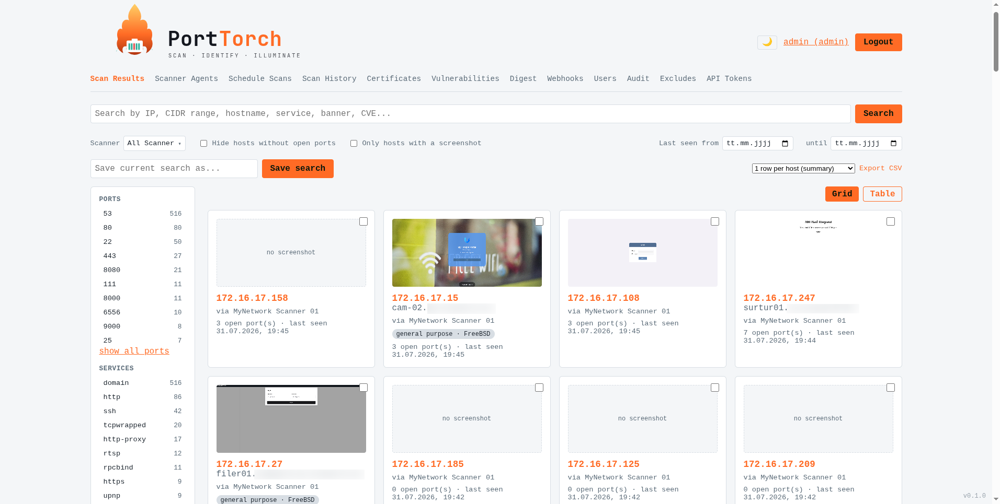
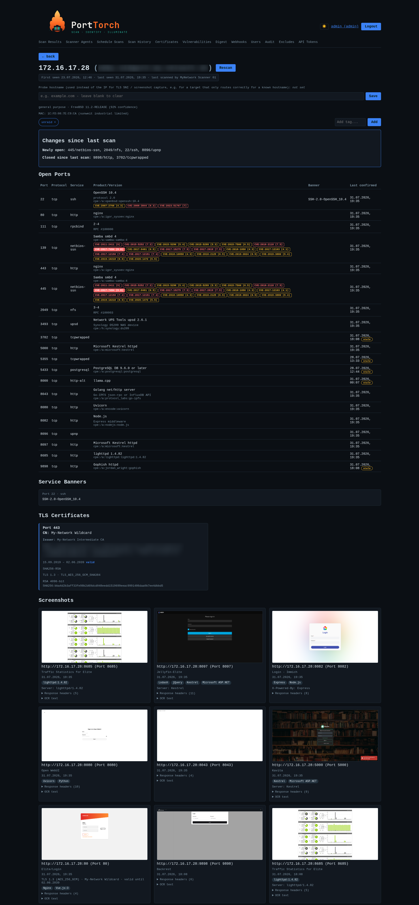
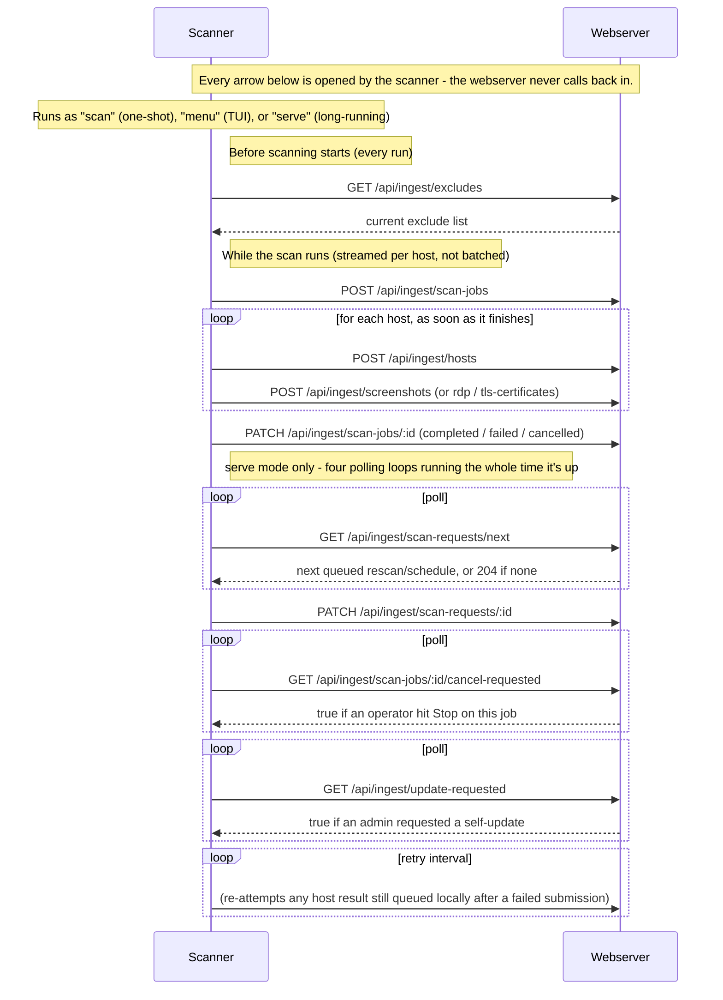

# PortTorch


[](https://github.com/BeNeDeLuX/PortTorch/blob/master/LICENSE)
[](https://github.com/BeNeDeLuX/PortTorch/stargazers)
[](https://github.com/BeNeDeLuX/PortTorch/commits/master/)
[](https://github.com/BeNeDeLuX/PortTorch/actions/workflows/webserver-docker.yml)
[](https://hub.docker.com/r/benedelux/porttorch-server)
[](https://github.com/BeNeDeLuX/PortTorch/tree/master/scanner)
[](https://github.com/BeNeDeLuX/PortTorch/tree/master/server)
[](https://github.com/BeNeDeLuX/PortTorch/issues)

> **Disclaimer:** This entire project - scanner, webserver, dashboard, and
> documentation - was built entirely with AI (Claude Code), with no
> hand-written code. Review it yourself before relying on it, especially
> for anything security-sensitive.
## Screenshots




> **Disclaimer:** This entire project - scanner, webserver, dashboard, and
> documentation - was built entirely with AI (Claude Code), with no
> hand-written code. Review it yourself before relying on it, especially
> for anything security-sensitive.

PortTorch is an internal, Shodan-style network reconnaissance platform. It
scans your internal network ranges, fingerprints what it finds (open ports,
service banners, TLS certificates, SSH host keys, OS/device type,
HTTP screenshots, RDP login screens), and makes all of it searchable in a
web dashboard.

It's well suited as continuous asset-discovery infrastructure for SOCs and
other IT teams that need an up-to-date, searchable picture of what's
actually running on their network - and can equally serve as an additional
data source feeding into a CMDB (Configuration Management Database),
alongside whatever other asset-tracking tools you already run.

The project has two independently deployed components:

- **`/scanner`** - a Go CLI that runs the scan pipeline (`masscan` → `nmap` →
  `gowitness`/RDP screenshots → TLS probe) and ships the results to the
  webserver. You can run several scanner instances (e.g. one per network
  segment), all feeding the same database.
- **`/server`** - a Node/TypeScript + PostgreSQL webserver with the React
  dashboard, authentication, and the database. This is the only component
  end users interact with directly.

> [!TIP]
> Want to get started quickly? Jump straight to [Quick start (Docker Compose)](#quick-start-docker-compose).

## Dashboard features

Each item below is a one-line summary - click **Details** to expand it.

- :mag: **Search** - free text across IP, hostname, banners, CVE ids, and OCR'd screenshot text; also accepts a single IP or CIDR range.
  <details>
  <summary>Details</summary>

  Free text across IP, hostname, service name/product, banners, known CVE ids (matched against the CVE correlation cache - see below), and text OCR'd from HTTP(S)/RDP screenshots (e.g. a login page's wording that never appears in any banner or header); also accepts a single IPv4 or IPv6 address, or a CIDR range of either (e.g. `10.0.0.0/24` or `2001:db8::/32`), to match all hosts in that subnet.
  </details>

- :toolbox: **Facets & filters** - port, service, host tag, OS family, device type, scanner agent, and last-seen date range, all combinable.
  <details>
  <summary>Details</summary>

  Filter by port, service, or host tag (multi-select, AND semantics: picking port 21 and 3389 means hosts with both open, not either), OS family, device type, or scanner agent (also multi-select, via a compact dropdown - useful once you're running more than one scanner, e.g. to look at a couple of network segments in isolation), and a last-seen date range; toggle "hide hosts without open ports" and "only hosts with a screenshot"; paginated (50/page) so large networks stay usable. Every filter combines with the free-text search box and with each other.
  </details>

- :card_index_dividers: **Grid or table view** - sortable/show-hide-able table columns, remembered per browser, with bulk-select actions.
  <details>
  <summary>Details</summary>

  Table view has sortable, show/hide-able columns (hostname, open port count, last seen, screenshot, OS/device, a compact CVE/KEV risk indicator); your choice of view and column layout is remembered per browser. Both views support selecting multiple hosts to bulk-tag or bulk-rescan at once. A host's device type, OS family, and scanner - both on the card/row itself, not just the sidebar - are clickable to filter by them directly from the list.
  </details>

- :floppy_disk: **Saved searches** - save a filter combination by name, get a webhook the first time a new host matches it.
  <details>
  <summary>Details</summary>

  Save the current filter combination by name; a background check every 5 minutes fires a `saved_search.match` webhook the first time a host newly starts matching (not repeatedly for hosts that already matched).
  </details>

- :outbox_tray: **Export data** - CSV (host or port level) or JSON, scoped to the current filters or a bulk selection.
  <details>
  <summary>Details</summary>

  Respects whatever filters are currently active, or - if one or more hosts are selected via the bulk-select checkboxes - just those hosts instead. A popup offers a one-row-per-host CSV summary (with an open-port count), a one-row-per-open-port detailed CSV (port/protocol/service columns) for a flat asset-inventory shape, or a JSON export (one object per host with a nested list of its open ports).
  </details>

- :desktop_computer: **Host detail page** - every port/banner/CVE/screenshot/certificate found for a host, plus history, tags, and comments.
  <details>
  <summary>Details</summary>

  Open ports with banners/CPE/OS hints and known CVEs (matched against detected service versions, synced daily from the NVD database - see below), anonymous FTP directory listings, SMB share enumeration plus OS/computer-name/domain info (`smb-os-discovery`), NetBIOS name/domain (`nbstat`), and protocol/security-mode info (`smb-protocols`, `smb-security-mode`/`smb2-security-mode` - whether legacy SMBv1 is still enabled, whether signing is required), NFS/rsync listings, an anonymous LDAP root DSE, RPC portmapper/MSRPC endpoint enumeration, whether common database/service daemons (MongoDB, Redis, MySQL, Memcached, Oracle, Docker, CouchDB, Cassandra) are reachable with no authentication, which HTTP methods a server allows (`http-methods`), the HTTP auth scheme a server requires (`http-auth`) and any exposed `.git` repository (`http-git`), RDP hostname/domain/OS build and encryption level leaked pre-auth (`rdp-ntlm-info`/`rdp-enum-encryption`), SSH algorithm/protocol-version info (`ssh2-enum-algos`/`sshv1`), an SMTP open-relay check, whether a DNS server is an open recursive resolver, and SNMP/IPMI asset info (both via a small separate UDP probe - see below) - all when the target allows a no-credentials session (also matched by the free-text search box), OS/device classification and MAC address (when available - see "What each scan does" below), TLS certificates (with expiry status), SSH host keys, HTTP(S) and RDP screenshots (with detected technologies, response headers, and OCR'd screenshot text), a full scan history timeline (with which scanner agent produced each entry), a "changes since last scan" diff, host tags, and an append-only comment log (each comment keeps its author and timestamp). Prev/next buttons step through whichever filtered/sorted host list you came from (including across a page boundary), so you can click through a search's results without going back to the list each time. Its own **Export data** popup exports just this host - CSV (one row per open port, including banners/CPEs/CVE ids), JSON (the full host record plus its ports), or a PDF snapshot of the page as shown, screenshots included.
  </details>

- :arrows_counterclockwise: **Rescan button** - on-demand rescan of a host's known open ports, with an NSE profile choice.
  <details>
  <summary>Details</summary>

  Triggers an on-demand rescan of a host's currently known open ports, picked up by whichever scanner last scanned it. Opens a confirmation popup offering a choice of NSE script profile (see **Scan Profiles** below) rather than firing immediately.
  </details>

- :alarm_clock: **Schedule Scans** - interval, cron-style, or one-time scan schedules using the same queue as Rescan.
  <details>
  <summary>Details</summary>

  Schedule a target/port spec to be scanned on a plain interval ("every N minutes"), a fixed schedule (every day, specific days of the week, or the Nth/last weekday of the month, all at a given time - with a point-and-click builder for the common cases plus a raw cron-expression field for anything else), or just once at a picked date and time. A one-time schedule auto-disables itself after it fires (kept, not deleted, for history) and can be re-armed to run again. Uses the same underlying request queue as the rescan button, including the same NSE script profile choice.
  </details>

- :test_tube: **Scan Profiles** (admin only) - choose which NSE scripts a scan actually runs: Default, All Safe Modules, or a Custom list.
  <details>
  <summary>Details</summary>

  Choose which NSE scripts a scan actually runs, per rescan or schedule: **Default** (the standard script set below), **All Safe Modules** (nmap's own much larger "safe" script category), or a named **Custom** profile with its own hand-picked script list, managed on its own admin page. A separate, opt-in-only **Active Modules** tier (intrusive/exploit/brute-force/denial-of-service scripts) can be added to a Custom profile's script list, clearly flagged wherever it's used - these are never included in Default or All Safe Modules, and should only ever be run against systems you're explicitly authorized to test that way.
  </details>

- :scroll: **Scan History** - every finished scan job, searchable/filterable, with the same live-log detail view as a running scan.
  <details>
  <summary>Details</summary>

  Every finished scan job (completed, failed, or cancelled) across every scanner, searchable by target/ports/scanner and filterable by status, showing how long it took and what it found (hosts scanned, open ports, screenshots, TLS certificates). The historical counterpart to the "Active scans" banner, which only shows what's running right now. Each row's "Details" button reopens the same scan-progress popup a running scan shows live, displaying the complete log for that scan (uploaded once by the scanner when it finishes) instead of polling for updates - or, for a scan that finished before this existed, the scanner's last pushed snapshot instead.
  </details>

- :closed_lock_with_key: **Certificates overview** - every TLS certificate across the fleet, soonest-expiring first.
  <details>
  <summary>Details</summary>

  Every TLS certificate across the whole fleet, sorted soonest-expiring first. Searchable by host, port, CN, or issuer, plus a checkbox to show only already-expired certificates.
  </details>

- :shield: **Vulnerabilities overview** - every known CVE match across the fleet in one sortable table.
  <details>
  <summary>Details</summary>

  Every known CVE match (see vulnerability correlation below) across the whole fleet in one sortable table - host, port, CVE, severity, description - instead of having to check each host's detail page individually.
  </details>

- :bar_chart: **Digest** - a fleet-wide "what changed" view over the last 24h/7d, also sendable daily by email/webhook.
  <details>
  <summary>Details</summary>

  A fleet-wide "what changed" view (newly discovered hosts, newly opened/closed ports) over the last 24 hours or 7 days. Also available as a daily email/webhook (`digest.daily`, see Webhooks below) - a fixed UTC hour (`DIGEST_EMAIL_HOUR_UTC` in `.env`, default 8) rather than a per-schedule picker.
  </details>

- :chart_with_upwards_trend: **Trends** - fleet-wide time series for hosts, scans, open ports, and CVE matches over a selectable range.
  <details>
  <summary>Details</summary>

  Fleet-wide time series (cumulative total hosts, and daily new hosts/scans/open-ports-seen/CVE-matches-seen) over a selectable range (7/30/90/365 days), filterable to one or more scanner agents. Chart or table view, same toggle style as the main dashboard's Grid/Table switch.
  </details>

- :bell: **Webhooks & email alerts** - Slack/Discord/Teams/email alerts for a long list of fleet events, with delivery history.
  <details>
  <summary>Details</summary>

  Fire a JSON POST (compatible with Slack/Discord incoming webhooks), a Microsoft Teams Adaptive Card (the current "Workflows" webhook, not the deprecated classic connector), or an email to one or more addresses when a new host appears, a port newly opens, a certificate (either a scanned host's, or the webserver's own) is about to expire, a saved search matches a new host, a known CVE's EPSS (exploit prediction) score crosses a threshold (`EPSS_ALERT_THRESHOLD` in `.env`, default 0.5), a known CVE is added to CISA's Known Exploited Vulnerabilities catalog, a running scan looks stalled, a scanner's self-update fails, a scanner's request queue is backing up, or once a day for the fleet-wide digest. Email requires `SMTP_HOST` (and friends) set in `.env` - webhook/Teams channels need no extra configuration. Every delivery attempt (success or failure) is recorded per webhook, viewable via a "History" button - the most recent 50 attempts, so you can tell whether a webhook is actually working without digging through logs.
  </details>

- :dna: **Vulnerability correlation** - daily CVE/EPSS/KEV sync against every detected service version.
  <details>
  <summary>Details</summary>

  A daily background job matches every CPE (service/version fingerprint) nmap has detected against the NVD vulnerability database and caches the result; the host detail page shows known CVEs per port with severity-colored badges linking to the NVD entry. Set `NVD_API_KEY` in `.env` to raise the sync rate limit from 5 to 50 requests/30s (works fine without one, just slower for a large number of distinct CPEs). A second daily sync fetches each known CVE's **EPSS score** (exploit prediction, from FIRST.org) - shown next to the CVSS severity on the Vulnerabilities page and per-port CVE badges, for prioritizing among CVEs that share the same severity rating. A third daily sync checks each known CVE against **CISA's Known Exploited Vulnerabilities (KEV) catalog** - unlike EPSS's predicted probability, KEV membership means CISA has confirmed the CVE is already being actively exploited; a red "KEV" badge appears alongside the CVE badge wherever CVEs are shown, and KEV-listed vulnerabilities sort ahead of CVSS score on the Vulnerabilities page (which also gets a "Known Exploited" filter chip).
  </details>

- :robot: **Scanner agent management** - create/revoke API keys, grouped by status, with live version and retry-backlog info.
  <details>
  <summary>Details</summary>

  Create/revoke API keys; revoking invalidates the key without deleting that scanner's scan history. A revoked agent can also be deleted from the list entirely - this only clears the agent row itself, its past scan jobs/requests stay in the database with the agent reference cleared, so scan history is never lost. Agents are grouped into **Scanning** / **Idle** / **Revoked** sections. Each agent reports its own version on every request, shown in the table - useful for spotting a fleet where some scanners haven't been upgraded. The table also shows each agent's current scan (target, ports, elapsed time) or "idle", refreshed every 5 seconds. A running scanner also reports its local retry-queue backlog (host submissions waiting to be resent after a transient failure), shown as a small badge when nonzero.
  </details>

- :rocket: **Scanner self-update** (admin only) - trigger a scanner to download, verify, and apply a new release itself.
  <details>
  <summary>Details</summary>

  When a scanner is behind the latest published release, an "Update" button (single agent, or a bulk "update all outdated") tells it to download, checksum-verify, and apply the new binary on its own next poll, then resume serving automatically - no SSH access or manual restart needed. Only works for scanners running in `serve` mode; a failed attempt retries automatically a few times before requiring an explicit re-trigger.
  </details>

- :vertical_traffic_light: **Fleet Health** - one page aggregating scanner staleness, version drift, queue backlogs, and TLS cert expiry.
  <details>
  <summary>Details</summary>

  A single page aggregating scanner staleness, version drift, pending/failed self-updates, the scan request queue backlog, the submission retry backlog, and the webserver's own TLS certificate expiry - each card links through to the page with the full detail. The main dashboard also shows a small banner when anything here needs attention.
  </details>

- :zap: **Active scans** - fleet-wide "what's running right now" banner, with live progress and a Stop button.
  <details>
  <summary>Details</summary>

  The same "what's running right now" information as a fleet-wide banner on the main dashboard (rather than per-agent), across every scanner and however the scan was triggered (manual `scan`, `menu`, or the rescan/schedule queue). Hidden entirely when nothing is running. Scans running under a `serve` scanner (its own `POST /scans` API or the rescan/schedule queue) show a **Stop** button - a `scan`/`menu` run has nothing checking for a stop signal while it's running, so those can't be stopped remotely and show no button. A **Details** button opens a live-updating popup with the scanner's own recent log lines - discovery (masscan/nmap) shown as a single done/active step, followed by a checklist of what's running concurrently after that (nmap enrichment, screenshots, TLS certificate probes, RDP capture, result submission), each marked not-started/seen/in-progress as the scanner streams progress in.
  </details>

- :no_entry_sign: **Scan excludes** (admin only) - IPs/ports/combos a scanner will never touch, global or per-scanner.
  <details>
  <summary>Details</summary>

  IPs (single address, CIDR, or an address range like `10.0.0.1-10.0.0.10`), ports/port ranges, or a specific IP+port combination (e.g. `10.0.0.5:3389`) that a scanner will never touch. Each exclude either applies to all scanners (the default) or is scoped to one specific scanner in addition to the defaults - useful since private IP ranges often repeat across scanners sitting in different networks, so excluding `10.0.0.5` for one scanner shouldn't also exclude an unrelated host with the same address elsewhere. Every scanner fetches its effective list (defaults + its own scoped excludes) fresh immediately before each scan (manual, menu, or queue-triggered) - not just scans started from the dashboard - so a change here takes effect on the very next scan.
  </details>

- :key: **API Tokens** (admin only) - tokens for external tools, separate from scanner keys, with optional expiry.
  <details>
  <summary>Details</summary>

  Manage tokens for external tools (see "External API" below); separate from Scanner Agent keys. An optional expiry (never / 30 / 90 / 365 days) can be set at creation time, after which the token stops authenticating on its own - no separate revoke step needed.
  </details>

- :busts_in_silhouette: **Multi-user accounts with roles** - admin/operator/user, plus optional per-account scanner restriction.
  <details>
  <summary>Details</summary>

  - **admin** - everything, including user/agent/schedule/webhook/exclude management. Always sees every scanner's results, regardless of any restriction below.
  - **operator** - can also rescan, tag hosts, and add comments; can't touch scanner agents, schedules, webhooks, excludes, or other users.
  - **user** - read-only.
  - An admin can additionally restrict an operator/user account to only see results from specific scanner agents (**Users → Edit access**) - applies fleet-wide (dashboard, host detail, scan history/active/queue, digest, vulnerabilities, certificates, scanner agents, schedules), not just the main search. Leaving no scanners assigned means unrestricted (today's default for every account).
  </details>

- :memo: **Audit log** (admin only) - who did what and when, filterable and exportable, with ids resolved to names.
  <details>
  <summary>Details</summary>

  Who did what and when, for every agent/schedule/tag/webhook/exclude/user/comment/rescan action plus login activity, separate from the structured stdout logs meant for SIEM ingestion. Filterable by event type and by actor (both multi-select), free-text search, and a date range; real pagination plus a CSV export that always matches whatever's currently filtered. Any id referenced in an entry's details (a scanner agent, webhook, scan profile, API token, host, user, ...) is resolved to its actual name inline, not just shown as a bare id - "deleted" if that entity's since been removed.
  </details>

- :wastebasket: **Host retention** - auto-purges hosts not seen in N days; the window and a manual cleanup live in Settings.
  <details>
  <summary>Details</summary>

  Hosts not seen (`last_seen_at`) in a configurable number of days (default 180) are purged automatically (hourly check), along with all their history - ports, screenshots, tags, comments, certificates. The retention window is set from the Settings page (admin only, `0` disables the sweep), and a "Clean up now" button there runs the same purge on demand instead of waiting for the next hourly check. Every purge is logged and shows up in the audit log.
  </details>

- :lock: **Login protection** - failed logins rate-limited per username and per source IP.
  <details>
  <summary>Details</summary>

  Failed logins are rate-limited per username and per source IP (5 attempts / 15 minutes).
  </details>

- :iphone: **Two-factor authentication** - optional per-account TOTP 2FA, with an admin-wide enforcement toggle.
  <details>
  <summary>Details</summary>

  Optional TOTP-based 2FA (any authenticator app: Google Authenticator, 1Password, Authy, etc.), set up per-account from the username link in the header ("Account" page). Comes with one-time recovery codes for when the device isn't available, and an admin can turn a user's 2FA back off if they lose it (never turn it on for them - that step is inherently self-service). An admin can also make 2FA mandatory for every admin account fleet-wide (Settings page) - an admin without it enabled is redirected straight to the setup page on their next login until they complete it; any admin can turn the requirement back off.
  </details>

- :closed_lock_with_key: **Webserver TLS certificate management** (admin only) - upload a real cert to replace the self-signed default, with expiry alerts.
  <details>
  <summary>Details</summary>

  Upload a real certificate/key pair to replace the self-signed one generated on first boot, applied live with no restart. Shows an expiry countdown and fires a webhook alert as it approaches expiry, the same as a scanned host's certificate.
  </details>

- :gear: **Account preferences** - per-account theme, accent color, page size, default scanner filter, and timezone/time format.
  <details>
  <summary>Details</summary>

  Also on the Account page: default theme, accent color (orange by default, or green/blue), how many hosts to show per page on the main dashboard, whether to default to a specific scanner there instead of "All Scanner", whether to show the Active Scans banner at all, and a timezone + 12h/24h time format applied to every date/time shown throughout the dashboard (defaults to the browser's own local zone/locale if left unset). Saved to your account, so - unlike the quick theme toggle or table column choices in the header, which are per-browser - these follow you to a new browser or device.
  </details>

## Quick start (Docker Compose)

> [!TIP]
> This is the fastest way to get the webserver running. You'll still need
> at least one scanner (see below) to populate it with data.

This brings up the webserver + PostgreSQL. You still need at least one
scanner (see below) to actually populate it with data.

```bash
git clone https://github.com/BeNeDeLuX/PortTorch.git
cd PortTorch
cp .env.example .env
```

Edit `.env` and set real values - at minimum, change `POSTGRES_PASSWORD`,
`SESSION_SECRET` (`openssl rand -hex 32`), and `ADMIN_PASSWORD`:

```bash
sudo docker compose up -d
```

This pulls the prebuilt webserver image from [Docker
Hub](https://hub.docker.com/r/benedelux/porttorch-server) (published
automatically by `.github/workflows/webserver-docker.yml` on every push to
`master` that touches `server/**`, tagged `:latest`, the commit SHA, and
the current version, e.g. `:0.3.0`), starts PostgreSQL, runs the database
migrations, and seeds the initial admin login from `ADMIN_USERNAME`/
`ADMIN_PASSWORD` - all automatically on boot. The webserver generates its
own self-signed TLS certificate on first start (persisted in a volume, so
it survives restarts).

If you've made local changes to `/server` and want to run those instead of
the published image, build from source with `sudo docker compose up -d
--build` (the `image:`/`build:` combo in `docker-compose.yml` means
`--build` overrides the pulled image with a freshly built,
identically-tagged one).

Open **`https://<host>/`** and log in with the admin credentials from
`.env`. Your browser will warn about the self-signed certificate the first
time - that's expected for a self-signed cert (see [Scanner
configuration](#scanner-configuration) below for how to trust it from the
scanner side instead of just clicking through).

See [Updating](#updating) below for how to pick up a new release later.

## Scanner installation

The scanner runs natively on Linux (not in Docker) since it needs raw
socket access for `masscan`/`nmap`, and may need to reach machines outside
any container network.

### Automated install (Debian/Ubuntu)

`scanner/install.sh` automates everything below for Debian (and
Debian-derivatives, **including Ubuntu** - it checks `ID`/`ID_LIKE` in
`/etc/os-release`, and Ubuntu's `ID_LIKE=debian` passes that check without a
warning): installs the required and optional packages, gets the
`porttorch` binary, builds `gowitness`, grants `masscan`/`nmap` their
capabilities, prompts for the webserver URL/API key to write
`config.yaml`, and installs a systemd service (`porttorch-scanner.service`)
running `porttorch serve` so rescans and recurring schedules work
unattended.

> [!NOTE]
> On Ubuntu, the *required* packages (`masscan`, `nmap`, `libcap2-bin`) install
> the same as on Debian - core scanning needs nothing extra. The *optional*
> ones (screenshots/RDP capture/OCR, best-effort - a failure only warns, it
> never aborts the install) can differ: `chromium` on Ubuntu 22.04+ pulls in
> a snap-based package instead of a native `.deb`, unlike Debian's. Run
> `porttorch doctor` after installing to confirm which optional features
> actually came up working.

If the checkout is exactly at a `scanner-vX.Y.Z` tag, the `porttorch`
binary is downloaded (checksum-verified) from that tag's GitHub Release
instead of being built - no Go toolchain needed on the target host at all.
Any other checkout (a branch, or commits ahead of the last tag) always
builds from source instead, same as before; `gowitness` is still always
built from source since it isn't part of this project's own releases. Pass
`--from-source` to force a local build even at a tagged release.

```bash
git clone https://github.com/BeNeDeLuX/PortTorch.git && cd PortTorch/scanner
sudo ./install.sh
```

Create the scanner agent first (**Dashboard → Scanner Agents → Create**)
so you have an API key ready when the script asks for it. Other distros
still need the manual steps below. See [Updating](#updating) below for
how to pick up a new version later.

### Manual install (other distros, or running without systemd)

> [!NOTE]
> Only needed if you're not on Debian/Debian-derivatives — `install.sh`
> already automates everything below.

The sections below are what `install.sh` automates for Debian - skip them if
you already ran it above. They also use a different config location: the
manual steps here write to *your own* account's home directory, whereas
`install.sh` writes to `/var/lib/porttorch/.config/porttorch/config.yaml`,
owned by the dedicated `porttorch` system user it creates - so don't be
surprised if `~/.config/porttorch/config.yaml` looks untouched after running
`install.sh`; that's expected, not a bug.

### Prerequisites

- Go 1.26+ (to build)
- `masscan` and `nmap` (required)
- `gowitness` v3 and a Chrome/Chromium binary (optional, for HTTP(S)
  screenshots)
- `xfreerdp3`, `Xvfb`, and ImageMagick's `import` (optional, for RDP login
  screenshots) - e.g. `sudo apt-get install -y freerdp3-x11 xvfb
  imagemagick`
- `tesseract-ocr` (optional, extracts searchable text from HTTP(S)/RDP
  screenshots) - `sudo apt-get install -y tesseract-ocr`

### Build

```bash
cd scanner
go build -o porttorch ./cmd/scanner
```

### Grant scanning capabilities

`masscan` and `nmap` need raw socket access. Rather than running the whole
scanner as root, grant just the two binaries the capabilities they need:

```bash
sudo setcap cap_net_raw,cap_net_admin+eip $(which masscan)
sudo setcap cap_net_raw,cap_net_admin+eip $(which nmap)
```

The scanner binary itself never needs to be root or setuid for normal
scanning. (The one exception - OS/device-type fingerprinting - is covered
below.)

### Register the scanner with the webserver

Every scanner authenticates with its own API key. Log into the dashboard as
an admin, go to **Scanner Agents → Create**, and copy the API key shown -
it's only displayed once.

### Configure

This writes to your own account's config directory - see the note above if
you used `install.sh`, which already wrote its own copy elsewhere and left
this one alone.

```bash
mkdir -p ~/.config/porttorch
cp scanner/config.example.yaml ~/.config/porttorch/config.yaml
```

Edit `config.yaml`. The two required fields:

```yaml
webserverUrl: "https://your-webserver:443"
apiKey: "<the key from Scanner Agents>"
```

Everything else has sensible defaults (see the comments in
`config.example.yaml` for the full list - masscan rate, screenshot
timeouts, RDP screen size, TLS probe timeout, poll interval, etc.). A few
worth knowing about up front:

- **TLS trust**: if you don't set `serverCaCertPath` to the webserver's
  self-signed cert, you'll need `insecureSkipVerify: true` for the scanner
  to be able to connect at all (not recommended outside quick tests).
- **`gowitnessPath`/`chromePath`**: only needed if those binaries aren't on
  `$PATH` under the exact names the scanner expects (e.g. `go install`
  puts `gowitness` in `~/go/bin`, which typically isn't on a service's
  `$PATH` - use the full path from `which gowitness` in that case).
- **`concurrency`** (default 5): how many hosts get enriched in parallel
  once masscan's initial pass finds them - this many nmap processes (each
  running `-sV` plus every NSE script against one host), plus the same
  number of parallel TLS certificate and SNMP probes, all running at once.
  Doesn't affect masscan itself, which is always a single process across
  the whole target range (`masscanRate` controls its pace instead).
  Raising it can meaningfully speed up a scan covering many hosts, given
  enough CPU/RAM on the scanner host and network headroom for the extra
  parallel traffic toward the target.
- **`gowitnessConcurrency`/`rdpConcurrency`** (default 2, separate from the
  general `concurrency: 5`): each gowitness/RDP screenshot spawns its own
  full Chrome instance or Xvfb+xfreerdp+import chain, far heavier than an
  nmap process - running as many of those in parallel as `concurrency`
  can starve every instance of CPU/RAM and make them all miss their
  timeout together (seen in practice as a wave of simultaneous "context
  deadline exceeded" failures). Raise these only if the scanner host has
  the headroom for that many simultaneous Chrome/RDP sessions.
- **`controlApiToken`**: required for `serve` mode (see below) - generate
  one yourself, e.g. `openssl rand -hex 32`.

### Running the scanner

Three modes, all sharing the exact same scan pipeline:

```bash
# One-shot scan from the command line, no menu
./porttorch scan --target 192.168.1.0/24 --ports 1-1000

# Same, but reading targets from a file instead (one target-spec fragment
# per line - IPs, CIDRs, ranges, or IPv6 addresses; blank lines and lines
# starting with # are skipped) - handy for a list of discontiguous ranges
# that don't reduce to one clean CIDR/range. Mutually exclusive with --target.
./porttorch scan --targets-file targets.txt --ports 1-1000

# See exactly what a scan would target (after excludes are applied)
# without actually running masscan/nmap or creating a scan job
./porttorch scan --target 192.168.1.0/24 --ports 1-1000 --dry-run

# Interactive terminal menu
./porttorch menu

# Long-running REST API + poller (needed for the dashboard's "Rescan"
# button and recurring schedules to work - the scanner has to be running
# continuously to pick those requests up)
./porttorch serve
```

Run `serve` as a long-lived process (e.g. a systemd service) if you want
to use rescans or schedules from the dashboard. `scan` and `menu` are
fine for ad-hoc, manual scanning - but only scans running under `serve`
can be stopped from the dashboard (see "Active scans" below), and only
`serve` mode can pick up a self-update request from the Scanner Agents
page (see "Dashboard features" above), since it's the only mode with
anything running in the background to notice either kind of request
while otherwise idle or mid-scan.

If a host result ever fails to submit to the webserver (a brief network
blip, the webserver restarting mid-scan, ...), the scanner queues it
locally and retries automatically - once at the start of the next scan
for `scan`/`menu`, and on a periodic background timer for `serve` - so a
transient outage doesn't silently lose that host's data. A submission the
webserver definitively rejects (invalid data) is not retried, since
retrying it unchanged would never succeed.

If you used `install.sh`, `serve` is already running as
`porttorch-scanner.service` - you don't need to start it yourself. For a
one-off `scan`/`menu` run instead, use the installed binary and config path
as the `porttorch` user rather than `./porttorch` from this checkout:

```bash
sudo -u porttorch /usr/local/bin/porttorch scan \
  --config /var/lib/porttorch/.config/porttorch/config.yaml \
  --target 192.168.1.0/24 --ports 1-1000
```

Before your first real scan (or after moving to a new machine), run:

```bash
./porttorch doctor
```

This checks the config file loads, masscan/nmap are on `$PATH` (or at
the configured path) and have `cap_net_raw,cap_net_admin` set (or the
process is root), gowitness/Chrome and the RDP screenshot tools are
found (warnings only - both features are best-effort), and that the
webserver is reachable and the configured API key is valid - all without
running an actual scan. Exits non-zero if masscan, nmap, or the
webserver connection fail.

### What each scan does

Before anything else, the scanner fetches the current scan-exclude list
from the webserver (dashboard's **Excludes** page, admin only) and applies
it - excluded IPs/CIDR/address ranges are passed to masscan's own
`--exclude` mechanism, excluded ports/ranges are subtracted from the
requested port spec. A third kind, a specific IP+port combination (e.g.
"don't screenshot RDP on this one host, but still scan its other ports"),
can't be expressed to masscan at all (it has no way to skip one port on
just one host within a larger range), so it's applied differently: masscan
still probes that exact host:port, and the result is only dropped
afterward, before nmap and everything past it ever sees it. This happens
for every scan, including a manual `scan`/`menu` run that never touches
the dashboard's request queue.

For every target, the pipeline runs:

1. **masscan** - fast port discovery across the target range. Since
   masscan is a stateless SYN scanner, a single lost packet in either
   direction means a genuinely open port just isn't reported that run -
   `masscanRetries` (default 2) resends each probe to reduce that.
   masscan has no IPv6 capability at all, so an IPv6 target (a single
   address, or a comma-separated list of specific addresses - not a
   CIDR/range, since IPv6 address space is too large to brute-force sweep)
   skips this step entirely and uses nmap itself for discovery instead;
   everything from stage 2 onward is unaffected.
2. **nmap** - service/version detection and banner grabbing on the ports
   masscan found, plus best-effort SSH host key capture (`ssh-hostkey`
   NSE script) and CPE/OS-hint extraction from nmap's own service
   fingerprinting. Also checks for anonymous/guest access on FTP and SMB
   (`ftp-anon`/`smb-enum-shares` NSE scripts, both in nmap's own read-only
   "safe" category) - if the target allows it without any credentials, the
   FTP directory listing or SMB share list is captured; nothing is
   attempted or guessed if it requires a real login. The same anonymous
   SMB session also runs `smb-os-discovery` (OS version, computer name,
   domain, workgroup), `nbstat` (NetBIOS name/domain), `smb-protocols`
   (which SMB dialects the server negotiates - is legacy SMBv1 still
   enabled), and `smb-security-mode`/`smb2-security-mode` (whether
   message signing is required). A few more read-only "safe" scripts
   round this out the same way: NFS exports (`nfs-showmount`), rsync
   modules (`rsync-list-modules`), an anonymous LDAP bind's root DSE
   (`ldap-rootdse`), the programs registered with a target's RPC
   portmapper (`rpcinfo`) and a Windows MSRPC endpoint mapper's own list
   of mapped services (`msrpc-enum`), which HTTP methods a server allows
   (`http-methods`), the HTTP auth scheme a server requires (`http-auth` -
   also explains why a host with an open HTTP port has no gowitness
   screenshot, see below), an exposed `.git` repository (`http-git`),
   hostname/domain/OS build leaked pre-auth via RDP (`rdp-ntlm-info`) and
   which RDP security layer is allowed (`rdp-enum-encryption`), SSH
   algorithm info and whether the obsolete SSHv1 protocol is enabled
   (`ssh2-enum-algos`/`sshv1`), and whether a handful of commonly
   left-open database/service daemons (MongoDB, Redis, MySQL, Memcached,
   Oracle, Docker's API, CouchDB, Cassandra) are reachable with no
   authentication at all. One check, `smtp-open-relay`, is not purely
   passive - it sends a handful of test messages through a target SMTP
   server to check whether it relays mail for third parties, the classic
   open-relay misconfiguration test.
3. **gowitness** - screenshots any port classified as HTTP(S), also
   capturing the TLS info, detected technologies, and full HTTP response
   headers gowitness sees along the way. Captured at `screenshotWidth`/
   `screenshotHeight` (default 1920x1080, higher than gowitness's own
   1280x720 default) for a sharper image in the dashboard's lightbox. A
   capture that fails with what looks like a timeout (as opposed to a
   deterministic failure) gets one automatic retry before being logged as
   failed - see `gowitnessConcurrency` below for why timeouts happen in
   the first place. If `tesseractPath` resolves to a working Tesseract
   binary, the captured screenshot is also OCR'd and the recognized text
   stored alongside it (best-effort - a missing/failed OCR never fails
   the screenshot itself).
4. **RDP screenshots** - for ports classified as RDP, spins up a virtual
   display and captures the login screen (only works against servers that
   still allow legacy RDP security - modern Windows defaults to Network
   Level Authentication, which can't be screenshotted without valid
   credentials; this is a protocol limitation, not a bug, and isn't
   retried since it would just fail identically every time). A
   timeout-like failure gets the same one retry as gowitness. Also OCR'd
   the same way as gowitness screenshots, when Tesseract is available.
5. **TLS certificate probe** - a real TLS handshake (Go standard library
   only) against every TLS-carrying port, not just HTTP(S) - also IMAPS,
   SMTPS, LDAPS, etc. Captures the certificate itself (CN, issuer, SANs,
   validity, fingerprint, self-signed detection) plus the negotiated
   handshake (TLS version, cipher suite) and the certificate's key
   algorithm/size.
6. **OS/device-type fingerprinting** (optional, root-only) - if the
   scanner process is running as root, nmap's `-O` also attempts to
   classify the host (e.g. "Windows", "Linux", or device types like
   "switch"/"router"/"printer"). This is skipped automatically when not
   running as root - nmap refuses to run `-O` at all without it, so the
   scanner only adds the flag when it detects `euid == 0`. Everything
   else above works the same either way; this is the one feature that
   genuinely needs root, not just the `setcap` capabilities above.
7. **MAC address** (best-effort, no root needed) - nmap resolves this via
   ARP, which only works for a target on the scanner's own local network
   segment; a target reached over a routed hop simply has none captured
   (this is a property of ARP itself, not something any flag or
   privilege changes).
8. **SNMP probe** (`snmp-info`/`snmp-sysdescr`/`snmp-interfaces`/
   `snmp-netstat`, community string `public`) - a small exception to the
   rest of this pipeline, which is entirely TCP: SNMP is UDP-only, so
   rather than adding general UDP scanning support, this is one extra,
   narrowly-scoped `nmap -sU -p 161` check run against every scanned host
   directly, independent of whatever TCP ports were actually discovered
   (bounded to 10 seconds per host, since "no response" on UDP is
   inherently slower to determine than on TCP). Still honors a scan
   exclude that specifically covers port 161, even though the normal
   TCP-only exclude mechanisms never see this path.
9. **IPMI probe** (`ipmi-version` against UDP/623) - the identical
   exception as the SNMP probe above, for the same reason (IPMI is also
   UDP-only) and built the same way. IPMI/BMC out-of-band management
   interfaces are a classic high-risk target - often left on default or
   no authentication, and easy to miss precisely because they sit
   outside a device's normal OS-level services.
10. **DNS recursion probe** (`dns-recursion` against UDP/53) - the same
    exception a third time, for the same reason (DNS recursion checks
    are only meaningful over UDP - that's the transport an open
    resolver actually gets abused over as a DNS amplification
    reflector). Flags an open recursive resolver reachable from
    anywhere, a real finding that puts third parties at risk, not just
    the resolver's own operator.
11. **UPnP probe** (`upnp-info` against UDP/1900) - a fourth copy of the
    same exception, asking any UPnP root device to describe itself (the
    same read a router/NAS/smart-TV's own control point would make).
    UPnP was never designed to be reachable past a single LAN, so a
    responder answering from beyond its own local segment is a real,
    common misconfiguration worth surfacing the same way an open
    SNMP/IPMI service already is.

By default, every scan runs the same fixed **Default** set of NSE scripts
described above. **Scan Profiles** (see "Dashboard features" above) let an
admin instead choose **All Safe Modules** (nmap's own much broader "safe"
script category) or a named **Custom** profile - including, opt-in only, a
separate "Active Modules" tier of intrusive/exploit/brute-force/DoS
scripts - per rescan or schedule, from the dashboard.

Steps 2-5 (plus the SNMP/IPMI/DNS-recursion/UPnP probes) run concurrently with each other rather
than as sequential batches, and **each host is submitted to the webserver
as soon as its own work finishes** - a host with no HTTP(S)/RDP/TLS-
carrying ports streams in right after its nmap call, while a different,
slower host's screenshot is still capturing. Only masscan itself can't
stream this way (it only
reports its discoveries once its entire pass across the target range
finishes - a limitation of the external tool, not a design choice here).
Besides showing up in the dashboard progressively during a long scan,
this means a scan that's killed, cancelled, or crashes partway through
doesn't lose everything - whatever hosts had already streamed in stay in
the database. A host whose submission fails is logged and skipped; the
rest of the scan keeps running.

### Monitoring a scanner with Prometheus

`serve` mode exposes a `/metrics` endpoint (same host/port as `listenAddr`
in `config.yaml`, default `:9090`) in standard Prometheus exposition
format, for watching a scanner's health independently of the dashboard's
own last-seen-based heuristics:

```
porttorch_scanner_uptime_seconds                          # seconds since this process started
porttorch_scanner_scanning                                # 1 if a scan is currently in progress, else 0
porttorch_scanner_scans_total{status="completed|failed|cancelled"}
porttorch_scanner_poll_failures_total                     # failed polls to the webserver's scan-request queue
porttorch_scanner_last_poll_success_timestamp_seconds
porttorch_scanner_last_poll_failure_timestamp_seconds
porttorch_scanner_submit_queue_pending                    # host submissions currently queued for retry
porttorch_scanner_binary_available{binary="masscan|nmap"} # 1 if resolvable on PATH, else 0
```

It requires the same bearer token as the rest of `serve`'s local REST API
(`controlApiToken` in `config.yaml`) - a scrape with no token, or the
wrong one, gets a `401`. Point Prometheus at it with:

```yaml
scrape_configs:
  - job_name: porttorch-scanner
    scheme: http
    static_configs:
      - targets: ["<scanner-host>:9090"]
    authorization:
      credentials: "<the same controlApiToken from config.yaml>"
```

## Updating

Webserver and scanner are versioned and updated independently (see
[Versioning](#versioning) below) - updating one doesn't require updating
the other, and different scanners can run different versions against the
same webserver.

### Webserver

```bash
sudo docker compose pull && sudo docker compose up -d
```

Pulls the latest published image and recreates the `webserver` container
(briefly restarting it; `postgres` is untouched unless its own pinned
image version changed). Database migrations run automatically on every
boot - only new/changed ones actually execute, so this is safe to run
repeatedly, including against an already-up-to-date install.

If you're running from a local checkout of the source instead of the
published image (see [Quick start](#quick-start-docker-compose) above),
`git pull` first, then `sudo docker compose up -d --build` instead - the
`image:`/`build:` combo in `docker-compose.yml` makes `--build` override
the pulled image with a freshly built, identically-tagged one.

### Scanner

```bash
cd PortTorch/scanner
git pull
sudo ./install.sh --rebuild-only
```

`--rebuild-only` skips the apt-get/gowitness/config/systemd-unit steps
from a full install and just gets the current `porttorch` binary -
downloaded from that commit's GitHub Release if the checkout is exactly
at a `scanner-vX.Y.Z` tag, otherwise built from source (see [Automated
install](#automated-install-debian) above) - and restarts
`porttorch-scanner.service`. Drop `--rebuild-only` (a plain `sudo
./install.sh`) instead if the update also needs new required/optional
system packages (a fresh `git pull` that added a new dependency, for
example) - it's always safe to re-run, since it leaves an existing
`config.yaml` untouched rather than prompting again.

To move to a specific released version rather than whatever's on the
branch tip: `git fetch --tags && git checkout scanner-vX.Y.Z` before
running the installer - that's what makes `--rebuild-only` (or a full
install) take the prebuilt-binary download path instead of building from
source.

**Alternatively**, a scanner running in `serve` mode can update itself
without touching the host at all - trigger it from the dashboard's
Scanner Agents page (see "Scanner self-update" under "Dashboard features"
above). It downloads and checksum-verifies the same release binary
`install.sh` would have, replaces itself on disk, and resumes serving
under the new version automatically. Existing deployments need `sudo
./install.sh --rebuild-only` run once first if they haven't already,
since the scanner needs write access to its own install directory to be
able to replace itself - `install.sh` sets this up automatically
(`getfacl /usr/local/bin` should show the `porttorch` user with `rwx`
after running it), and a self-update attempt fails with a clear "binary
or directory not writable" reason if that hasn't happened yet.

## External API (SOAR / enrichment integrations)

For external tools (SOAR platforms, ticketing systems, enrichment
pipelines) that need to query host data or trigger a rescan
programmatically - separate from both the dashboard (session cookies)
and the scanner ingest API (per-scanner API keys tied to submitting scan
results). Manage tokens from **Admin login → API Tokens → Create**; the
plaintext token is shown once.

```bash
# Look up a host by IP or hostname - returns open ports, service/version
# fingerprints, known CVEs (from the vulnerability correlation cache),
# tags, and when/by which scanner it was last seen.
curl -H "Authorization: Bearer <token>" \
  "https://porttorch.internal/api/v1/hosts/lookup?ip=10.0.0.5"
curl -H "Authorization: Bearer <token>" \
  "https://porttorch.internal/api/v1/hosts/lookup?hostname=web01.internal"

# Trigger a rescan of a known host's currently-open ports (same mechanism
# as the dashboard's Rescan button/schedules - queues a scan_requests row
# for whichever scanner agent last scanned it). Defaults to the Default
# NSE profile if "profile" is omitted.
curl -X POST -H "Authorization: Bearer <token>" -H "Content-Type: application/json" \
  -d '{"ip":"10.0.0.5"}' \
  "https://porttorch.internal/api/v1/hosts/rescan"

# Same, but with an explicit NSE profile - "default", "all_safe", or the
# exact name of a Custom profile from the Scan Profiles page (no need to
# know its internal id). Returns which profile was actually used.
curl -X POST -H "Authorization: Bearer <token>" -H "Content-Type: application/json" \
  -d '{"ip":"10.0.0.5","profile":"all_safe"}' \
  "https://porttorch.internal/api/v1/hosts/rescan"

# Stop whatever scan is currently running against a host (only ever one
# triggered via the rescan/schedule queue, same as above - not an
# unrelated ad-hoc scan that just happens to cover this host's IP).
curl -X POST -H "Authorization: Bearer <token>" -H "Content-Type: application/json" \
  -d '{"ip":"10.0.0.5"}' \
  "https://porttorch.internal/api/v1/hosts/cancel-scan"
```

All three endpoints return `404` for an unknown host; rescan returns
`400` if the host has no currently-known open ports or no scan history to
infer a scanner from (same constraints as the dashboard's Rescan button),
or if `profile` doesn't match `"default"`, `"all_safe"`, or an existing
Custom profile's name; cancel-scan returns `404` if nothing is currently
running for that host.
Every rescan/cancel trigger is logged and shows up in the audit log,
attributed to the token's name (`api-token:<name>`).

If you run scanners across multiple, non-interconnected networks with
overlapping private IP ranges, the same `ip` can validly belong to more
than one host - in that case these endpoints return `409` with a list of
candidates instead of guessing:

```bash
curl -H "Authorization: Bearer <token>" \
  "https://porttorch.internal/api/v1/hosts/lookup?ip=10.0.0.5&scannerAgent=office-berlin"
```

## Shipping logs to a SIEM

Every stdout line from both the webserver and the scanner is a single
JSON object, one event per line - no plain-text logging mixed in (the
scanner's interactive `menu` is the one exception, since it owns the
whole terminal screen). `scan_job_id` correlates events across both
services for the same scan run. Never logged: API keys, passwords,
session cookies, `Authorization` headers.

Any log shipper that can read Docker container output works. Two
common options:

**Docker's built-in `syslog` driver** - simplest if your SIEM (Splunk,
QRadar, Graylog, etc.) already accepts syslog input. Add to the
service(s) you want shipped in `docker-compose.yml`:

```yaml
services:
  webserver:
    # ... existing config ...
    logging:
      driver: syslog
      options:
        syslog-address: "udp://siem.internal:514"
        tag: "porttorch-webserver"
```

Apply the same block under `postgres` if you also want the database
container's own logs shipped (PortTorch's own JSON events all come from
`webserver`, so this is usually the only service that matters here).

**Fluent Bit (or Fluentd) forwarder** - more flexible if your SIEM
needs a specific output format (Splunk HEC, Elasticsearch, HTTP, etc.)
that Fluent Bit has a plugin for. Docker has a matching built-in
`fluentd` log driver, so no host-path bind-mounts are needed - point it
at a Fluent Bit container listening for the forward protocol:

```yaml
services:
  webserver:
    # ... existing config ...
    logging:
      driver: fluentd
      options:
        fluentd-address: localhost:24224
        tag: porttorch.webserver
```

```ini
# fluent-bit.conf - swap the [OUTPUT] block for your SIEM's plugin
# (splunk, es, http, etc. - see the Fluent Bit docs for the full list)
[INPUT]
    Name              forward
    Listen            0.0.0.0
    Port              24224

[OUTPUT]
    Name              http
    Match             porttorch.*
    Host              siem.internal
    Port              8088
    URI               /services/collector/event
    Format            json
    Header            Authorization Splunk <hec-token>
```

Either way, since every line is already valid JSON, no parsing/grok
rules are needed on the SIEM side beyond "treat each line as JSON."

The scanner isn't in `docker-compose.yml` at all (it's a systemd
service on whatever host you installed it on - see "Scanner
installation" above), so its logs go through `journald` instead of a
Docker logging driver. Point the same Fluent Bit (or your SIEM's own
agent) at journald directly:

```ini
[INPUT]
    Name           systemd
    Tag            porttorch.scanner
    Systemd_Filter _SYSTEMD_UNIT=porttorch-scanner.service
```

**All communication is scanner-initiated** (outbound HTTPS from the scanner
to the webserver). The webserver never reaches back into a scanner's
network - this is deliberate, since scanners may sit behind NAT/firewalls on
arbitrary internal subnets the webserver can't route to. Every request
authenticates with that scanner's own API key (`Scanner Agents → Create` in
the dashboard) and carries `X-Scanner-Version` and `X-Scanner-Submit-Queue-Pending`
headers (the latter reporting how many host results, if any, are currently
queued locally for retry after a failed submission).



The last two polling loops are what let the dashboard's "Rescan" button and
recurring schedules reach a scanner at all, and what lets the "Stop" button
on a running scan actually take effect - see [`CLAUDE.md`](./CLAUDE.md)'s
"Schedule Scans and the rescan button share one mechanism" section for the
request queue they poll against.

## Versioning

The webserver and scanner are versioned independently (they're deployed
separately - see above). The webserver's version is shown as a small
badge in the bottom-right corner of the dashboard once logged in; the
scanner's is available via `porttorch --version` (also shown as the
first line of `porttorch doctor`'s report).

## Development

See [`CLAUDE.md`](./CLAUDE.md) for build/test commands and the deeper
architecture notes (database schema rationale, the scan-request queue
mechanism shared by rescans and schedules, logging conventions, etc.).

## License

MIT - see [`LICENSE`](./LICENSE).
