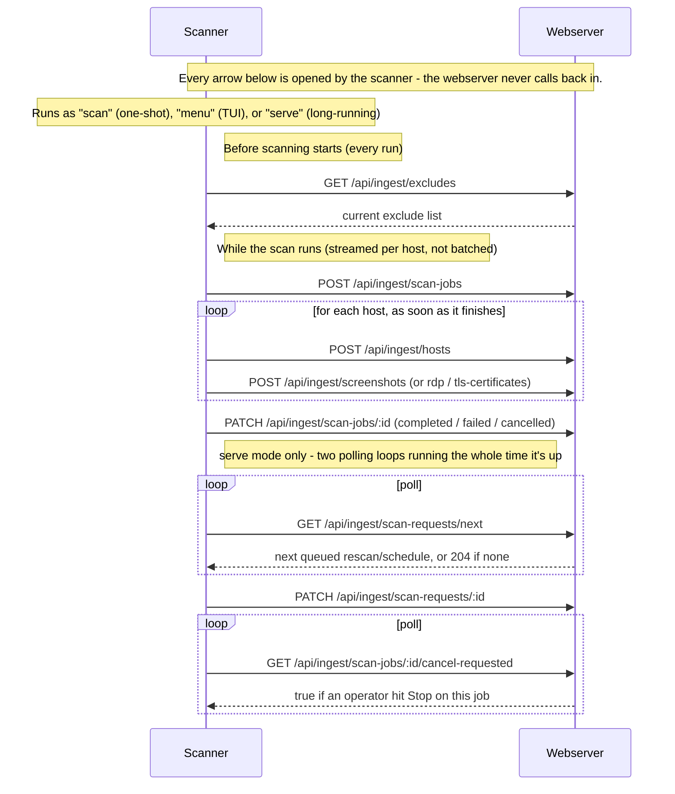

# PortTorch


[](https://github.com/BeNeDeLuX/PortTorch/blob/master/LICENSE)
[](https://github.com/BeNeDeLuX/PortTorch/stargazers)
[](https://github.com/BeNeDeLuX/PortTorch/commits/master/)
[](https://github.com/BeNeDeLuX/PortTorch/actions/workflows/webserver-docker.yml)
[](https://hub.docker.com/r/benedelux/porttorch-server)
[](https://github.com/BeNeDeLuX/PortTorch/tree/master/scanner)
[](https://github.com/BeNeDeLuX/PortTorch/tree/master/server)
[](https://github.com/BeNeDeLuX/PortTorch/issues)

> **Disclaimer:** This entire project - scanner, webserver, dashboard, and
> documentation - was built entirely with AI (Claude Code), with no
> hand-written code. Review it yourself before relying on it, especially
> for anything security-sensitive.
## Screenshots


> **Disclaimer:** This entire project - scanner, webserver, dashboard, and
> documentation - was built entirely with AI (Claude Code), with no
> hand-written code. Review it yourself before relying on it, especially
> for anything security-sensitive.

PortTorch is an internal, Shodan-style network reconnaissance platform. It
scans your internal network ranges, fingerprints what it finds (open ports,
service banners, TLS certificates, SSH host keys, OS/device type,
HTTP screenshots, RDP login screens), and makes all of it searchable in a
web dashboard.

It's well suited as continuous asset-discovery infrastructure for SOCs and
other IT teams that need an up-to-date, searchable picture of what's
actually running on their network - and can equally serve as an additional
data source feeding into a CMDB (Configuration Management Database),
alongside whatever other asset-tracking tools you already run.

The project has two independently deployed components:

- **`/scanner`** - a Go CLI that runs the scan pipeline (`masscan` → `nmap` →
  `gowitness`/RDP screenshots → TLS probe) and ships the results to the
  webserver. You can run several scanner instances (e.g. one per network
  segment), all feeding the same database.
- **`/server`** - a Node/TypeScript + PostgreSQL webserver with the React
  dashboard, authentication, and the database. This is the only component
  end users interact with directly.

## Dashboard features

- :mag: **Search** - free text across IP, hostname, service name/product,
  banners, known CVE ids (matched against the CVE correlation cache - see
  below), and text OCR'd from HTTP(S)/RDP screenshots (e.g. a login page's
  wording that never appears in any banner or header); also accepts a
  single IPv4 or IPv6 address, or a CIDR range of either (e.g.
  `10.0.0.0/24` or `2001:db8::/32`), to match all hosts in that subnet.
- :toolbox: **Facets & filters** - filter by port, service, or host tag (multi-select,
  AND semantics: picking port 21 and 3389 means hosts with both open, not
  either), OS family, device type, or scanner agent (also multi-select, via
  a compact dropdown - useful once you're running more than one scanner,
  e.g. to look at a couple of network segments in isolation), and a
  last-seen date range; toggle "hide hosts without open ports" and "only
  hosts with a screenshot"; paginated (50/page) so large networks stay
  usable. Every filter combines with the free-text search box and with
  each other.
- :card_index_dividers: **Grid or table view** - table view has sortable, show/hide-able columns
  (hostname, open port count, last seen, screenshot, OS/device); your
  choice of view and column layout is remembered per browser. Both views
  support selecting multiple hosts to bulk-tag or bulk-rescan at once.
- :floppy_disk: **Saved searches** - save the current filter combination by name; a
  background check every 5 minutes fires a `saved_search.match` webhook
  the first time a host newly starts matching (not repeatedly for hosts
  that already matched).
- :outbox_tray: **Export data** - respects whatever filters are currently active. A popup
  offers a one-row-per-host CSV summary (with an open-port count), a
  one-row-per-open-port detailed CSV (port/protocol/service columns) for a
  flat asset-inventory shape, or a JSON export (one object per host with a
  nested list of its open ports).
- :desktop_computer: **Host detail page** - open ports with banners/CPE/OS hints and known
  CVEs (matched against detected service versions, synced daily from the
  NVD database - see below), OS/device classification and MAC address
  (when available - see "What each scan does" above), TLS certificates
  (with expiry status), SSH host keys, HTTP(S) and RDP screenshots (with
  detected technologies, response headers, and OCR'd screenshot text), a
  full scan history timeline (with which scanner agent produced each
  entry), a "changes since last scan" diff, host tags, and an append-only
  comment log (each comment keeps its author and timestamp). Prev/next
  buttons step through whichever filtered/sorted host list you came from
  (including across a page boundary), so you can click through a search's
  results without going back to the list each time. Its own **Export data**
  popup exports just this host - CSV (one row per open port, including
  banners/CPEs/CVE ids), JSON (the full host record plus its ports), or a
  PDF snapshot of the page as shown, screenshots included.
- :arrows_counterclockwise: **Rescan button** - triggers an on-demand rescan of a host's currently
  known open ports, picked up by whichever scanner last scanned it.
- :alarm_clock: **Schedule Scans** - schedule a target/port spec to be scanned on a plain
  interval ("every N minutes"), a fixed schedule (every day, specific days
  of the week, or the Nth/last weekday of the month, all at a given time -
  with a point-and-click builder for the common cases plus a raw
  cron-expression field for anything else), or just once at a picked date
  and time. A one-time schedule auto-disables itself after it fires
  (kept, not deleted, for history) and can be re-armed to run again.
  Uses the same underlying request queue as the rescan button.
- :scroll: **Scan History** - every finished scan job (completed, failed, or
  cancelled) across every scanner, searchable by target/ports/scanner
  and filterable by status, showing how long it took and what it found
  (hosts scanned, open ports, screenshots, TLS certificates). The
  historical counterpart to the "Active scans" banner, which only
  shows what's running right now.
- :closed_lock_with_key: **Certificates overview** - every TLS certificate across the whole
  fleet, sorted soonest-expiring first. Searchable by host, port, CN, or
  issuer, plus a checkbox to show only already-expired certificates.
- :shield: **Vulnerabilities overview** - every known CVE match (see vulnerability
  correlation above) across the whole fleet in one sortable table - host,
  port, CVE, severity, description - instead of having to check each
  host's detail page individually.
- :bar_chart: **Digest** - a fleet-wide "what changed" view (newly discovered hosts,
  newly opened/closed ports) over the last 24 hours or 7 days.
- :chart_with_upwards_trend: **Trends** - fleet-wide time series (cumulative total
  hosts, and daily new hosts/scans/open-ports-seen/CVE-matches-seen) over a
  selectable range (7/30/90/365 days), filterable to one or more scanner
  agents. Chart or table view, same toggle style as the main dashboard's
  Grid/Table switch.
- :bell: **Webhooks & email alerts** - fire a JSON POST (compatible with
  Slack/Discord incoming webhooks) or an email to one or more addresses when
  a new host appears, a port newly opens, a certificate is about to expire,
  or a saved search matches a new host. Email requires `SMTP_HOST` (and
  friends) set in `.env` - webhook channels need no extra configuration.
- :dna: **Vulnerability correlation** - a daily background job matches every
  CPE (service/version fingerprint) nmap has detected against the NVD
  vulnerability database and caches the result; the host detail page
  shows known CVEs per port with severity-colored badges linking to the
  NVD entry. Set `NVD_API_KEY` in `.env` to raise the sync rate limit
  from 5 to 50 requests/30s (works fine without one, just slower for a
  large number of distinct CPEs). A second daily sync fetches each known
  CVE's **EPSS score** (exploit prediction, from FIRST.org) - shown next to
  the CVSS severity on the Vulnerabilities page and per-port CVE badges, for
  prioritizing among CVEs that share the same severity rating.
- :robot: **Scanner agent management** - create/revoke API keys; revoking
  invalidates the key without deleting that scanner's scan history. A
  revoked agent can also be deleted from the list entirely - this only
  clears the agent row itself, its past scan jobs/requests stay in the
  database with the agent reference cleared, so scan history is never
  lost. Agents are grouped into **Scanning** / **Idle** / **Revoked**
  sections. Each agent reports its own version on every request, shown in
  the table - useful for spotting a fleet where some scanners haven't
  been upgraded. The table also shows each agent's current scan (target,
  ports, elapsed time) or "idle", refreshed every 5 seconds.
- :zap: **Active scans** - the same "what's running right now" information as
  a fleet-wide banner on the main dashboard (rather than per-agent),
  across every scanner and however the scan was triggered (manual
  `scan`, `menu`, or the rescan/schedule queue). Hidden entirely when
  nothing is running. Scans running under a `serve` scanner (its own
  `POST /scans` API or the rescan/schedule queue) show a **Stop** button -
  a `scan`/`menu` run has nothing checking for a stop signal while it's
  running, so those can't be stopped remotely and show no button. A **Details**
  button opens a live-updating popup with the scanner's own recent log lines -
  discovery (masscan/nmap) shown as a single done/active step, followed by a
  checklist of what's running concurrently after that (nmap enrichment,
  screenshots, TLS certificate probes, RDP capture, result submission), each
  marked not-started/seen/in-progress as the scanner streams progress in.
- :no_entry_sign: **Scan excludes** (admin only) - IPs (single address, CIDR, or an
  address range like `10.0.0.1-10.0.0.10`), ports/port ranges, or a
  specific IP+port combination (e.g. `10.0.0.5:3389`) that a scanner will
  never touch. Each exclude either applies to all scanners (the default)
  or is scoped to one specific scanner in addition to the defaults -
  useful since private IP ranges often repeat across scanners sitting in
  different networks, so excluding `10.0.0.5` for one scanner shouldn't
  also exclude an unrelated host with the same address elsewhere. Every
  scanner fetches its effective list (defaults + its own scoped excludes)
  fresh immediately before each scan (manual, menu, or queue-triggered) -
  not just scans started from the dashboard - so a change here takes
  effect on the very next scan.
- :key: **API Tokens** (admin only) - manage tokens for external tools (see
  "External API" below); separate from Scanner Agent keys.
- :busts_in_silhouette: **Multi-user accounts with roles**:
  - **admin** - everything, including user/agent/schedule/webhook/exclude
    management. Always sees every scanner's results, regardless of any
    restriction below.
  - **operator** - can also rescan, tag hosts, and add comments; can't
    touch scanner agents, schedules, webhooks, excludes, or other users.
  - **user** - read-only.
  - An admin can additionally restrict an operator/user account to only
    see results from specific scanner agents (**Users → Edit access**) -
    applies fleet-wide (dashboard, host detail, scan history/active/queue,
    digest, vulnerabilities, certificates, scanner agents, schedules), not
    just the main search. Leaving no scanners assigned means unrestricted
    (today's default for every account).
- :memo: **Audit log** (admin only) - who did what and when, for every
  agent/schedule/tag/webhook/exclude/user/comment/rescan action plus login
  activity, separate from the structured stdout logs meant for SIEM
  ingestion.
- :wastebasket: **Host retention** - hosts not seen (`last_seen_at`) in 180 days are
  purged automatically (hourly check), along with all their history -
  ports, screenshots, tags, comments, certificates. Configurable via
  `HOST_RETENTION_DAYS` in `.env` (`0` disables it); every purge is
  logged and shows up in the audit log.
- :lock: **Login protection** - failed logins are rate-limited per username and
  per source IP (5 attempts / 15 minutes).
- :iphone: **Two-factor authentication** - optional TOTP-based 2FA (any authenticator
  app: Google Authenticator, 1Password, Authy, etc.), set up per-account from
  the username link in the header ("Account" page). Comes with one-time
  recovery codes for when the device isn't available, and an admin can turn
  a user's 2FA back off if they lose it (never turn it on for them - that
  step is inherently self-service).
- :gear: **Account preferences** - also on the Account page: default theme, accent
  color (green, orange, or blue), how many hosts to show per page on the
  main dashboard, whether to default to a specific scanner there instead of
  "All Scanner", whether to show the Active Scans banner at all, and a
  timezone + 12h/24h time format applied to every date/time shown
  throughout the dashboard (defaults to the browser's own local
  zone/locale if left unset). Saved to your account, so - unlike the quick
  theme toggle or table column choices in the header, which are
  per-browser - these follow you to a new browser or device.

## Quick start (Docker Compose)

This brings up the webserver + PostgreSQL. You still need at least one
scanner (see below) to actually populate it with data.

```bash
git clone https://github.com/BeNeDeLuX/PortTorch.git
cd PortTorch
cp .env.example .env
```

Edit `.env` and set real values - at minimum, change `POSTGRES_PASSWORD`,
`SESSION_SECRET` (`openssl rand -hex 32`), and `ADMIN_PASSWORD`:

```bash
sudo docker compose up -d
```

This pulls the prebuilt webserver image from [Docker
Hub](https://hub.docker.com/r/benedelux/porttorch-server) (published
automatically by `.github/workflows/webserver-docker.yml` on every push to
`master` that touches `server/**`), starts PostgreSQL, runs the database
migrations, and seeds the initial admin login from `ADMIN_USERNAME`/
`ADMIN_PASSWORD` - all automatically on boot. The webserver generates its
own self-signed TLS certificate on first start (persisted in a volume, so
it survives restarts).

If you've made local changes to `/server` and want to run those instead of
the published image, build from source with `sudo docker compose up -d
--build` (the `image:`/`build:` combo in `docker-compose.yml` means
`--build` overrides the pulled image with a freshly built,
identically-tagged one).

Open **`https://<host>/`** and log in with the admin credentials from
`.env`. Your browser will warn about the self-signed certificate the first
time - that's expected for a self-signed cert (see [Scanner
configuration](#scanner-configuration) below for how to trust it from the
scanner side instead of just clicking through).

See [Updating](#updating) below for how to pick up a new release later.

## Scanner installation

The scanner runs natively on Linux (not in Docker) since it needs raw
socket access for `masscan`/`nmap`, and may need to reach machines outside
any container network.

### Automated install (Debian)

`scanner/install.sh` automates everything below for Debian (and
Debian-derivatives): installs the required and optional packages, gets the
`porttorch` binary, builds `gowitness`, grants `masscan`/`nmap` their
capabilities, prompts for the webserver URL/API key to write
`config.yaml`, and installs a systemd service (`porttorch-scanner.service`)
running `porttorch serve` so rescans and recurring schedules work
unattended.

If the checkout is exactly at a `scanner-vX.Y.Z` tag, the `porttorch`
binary is downloaded (checksum-verified) from that tag's GitHub Release
instead of being built - no Go toolchain needed on the target host at all.
Any other checkout (a branch, or commits ahead of the last tag) always
builds from source instead, same as before; `gowitness` is still always
built from source since it isn't part of this project's own releases. Pass
`--from-source` to force a local build even at a tagged release.

```bash
git clone https://github.com/BeNeDeLuX/PortTorch.git && cd PortTorch/scanner
sudo ./install.sh
```

Create the scanner agent first (**Dashboard → Scanner Agents → Create**)
so you have an API key ready when the script asks for it. Other distros
still need the manual steps below. See [Updating](#updating) below for
how to pick up a new version later.

### Manual install (other distros, or running without systemd)

The sections below are what `install.sh` automates for Debian - skip them if
you already ran it above. They also use a different config location: the
manual steps here write to *your own* account's home directory, whereas
`install.sh` writes to `/var/lib/porttorch/.config/porttorch/config.yaml`,
owned by the dedicated `porttorch` system user it creates - so don't be
surprised if `~/.config/porttorch/config.yaml` looks untouched after running
`install.sh`; that's expected, not a bug.

### Prerequisites

- Go 1.26+ (to build)
- `masscan` and `nmap` (required)
- `gowitness` v3 and a Chrome/Chromium binary (optional, for HTTP(S)
  screenshots)
- `xfreerdp3`, `Xvfb`, and ImageMagick's `import` (optional, for RDP login
  screenshots) - e.g. `sudo apt-get install -y freerdp3-x11 xvfb
  imagemagick`
- `tesseract-ocr` (optional, extracts searchable text from HTTP(S)/RDP
  screenshots) - `sudo apt-get install -y tesseract-ocr`

### Build

```bash
cd scanner
go build -o porttorch ./cmd/scanner
```

### Grant scanning capabilities

`masscan` and `nmap` need raw socket access. Rather than running the whole
scanner as root, grant just the two binaries the capabilities they need:

```bash
sudo setcap cap_net_raw,cap_net_admin+eip $(which masscan)
sudo setcap cap_net_raw,cap_net_admin+eip $(which nmap)
```

The scanner binary itself never needs to be root or setuid for normal
scanning. (The one exception - OS/device-type fingerprinting - is covered
below.)

### Register the scanner with the webserver

Every scanner authenticates with its own API key. Log into the dashboard as
an admin, go to **Scanner Agents → Create**, and copy the API key shown -
it's only displayed once.

### Configure

This writes to your own account's config directory - see the note above if
you used `install.sh`, which already wrote its own copy elsewhere and left
this one alone.

```bash
mkdir -p ~/.config/porttorch
cp scanner/config.example.yaml ~/.config/porttorch/config.yaml
```

Edit `config.yaml`. The two required fields:

```yaml
webserverUrl: "https://your-webserver:443"
apiKey: "<the key from Scanner Agents>"
```

Everything else has sensible defaults (see the comments in
`config.example.yaml` for the full list - masscan rate, screenshot
timeouts, RDP screen size, TLS probe timeout, poll interval, etc.). A few
worth knowing about up front:

- **TLS trust**: if you don't set `serverCaCertPath` to the webserver's
  self-signed cert, you'll need `insecureSkipVerify: true` for the scanner
  to be able to connect at all (not recommended outside quick tests).
- **`gowitnessPath`/`chromePath`**: only needed if those binaries aren't on
  `$PATH` under the exact names the scanner expects (e.g. `go install`
  puts `gowitness` in `~/go/bin`, which typically isn't on a service's
  `$PATH` - use the full path from `which gowitness` in that case).
- **`gowitnessConcurrency`/`rdpConcurrency`** (default 2, separate from the
  general `concurrency: 5`): each gowitness/RDP screenshot spawns its own
  full Chrome instance or Xvfb+xfreerdp+import chain, far heavier than an
  nmap process - running as many of those in parallel as `concurrency`
  can starve every instance of CPU/RAM and make them all miss their
  timeout together (seen in practice as a wave of simultaneous "context
  deadline exceeded" failures). Raise these only if the scanner host has
  the headroom for that many simultaneous Chrome/RDP sessions.
- **`controlApiToken`**: required for `serve` mode (see below) - generate
  one yourself, e.g. `openssl rand -hex 32`.

### Running the scanner

Three modes, all sharing the exact same scan pipeline:

```bash
# One-shot scan from the command line, no menu
./porttorch scan --target 192.168.1.0/24 --ports 1-1000

# Interactive terminal menu
./porttorch menu

# Long-running REST API + poller (needed for the dashboard's "Rescan"
# button and recurring schedules to work - the scanner has to be running
# continuously to pick those requests up)
./porttorch serve
```

Run `serve` as a long-lived process (e.g. a systemd service) if you want
to use rescans or schedules from the dashboard. `scan` and `menu` are
fine for ad-hoc, manual scanning - but only scans running under `serve`
can be stopped from the dashboard (see "Active scans" below), since
`serve` is the only mode with something running in the background to
notice a stop request while a scan is in progress.

If you used `install.sh`, `serve` is already running as
`porttorch-scanner.service` - you don't need to start it yourself. For a
one-off `scan`/`menu` run instead, use the installed binary and config path
as the `porttorch` user rather than `./porttorch` from this checkout:

```bash
sudo -u porttorch /usr/local/bin/porttorch scan \
  --config /var/lib/porttorch/.config/porttorch/config.yaml \
  --target 192.168.1.0/24 --ports 1-1000
```

Before your first real scan (or after moving to a new machine), run:

```bash
./porttorch doctor
```

This checks the config file loads, masscan/nmap are on `$PATH` (or at
the configured path) and have `cap_net_raw,cap_net_admin` set (or the
process is root), gowitness/Chrome and the RDP screenshot tools are
found (warnings only - both features are best-effort), and that the
webserver is reachable and the configured API key is valid - all without
running an actual scan. Exits non-zero if masscan, nmap, or the
webserver connection fail.

### What each scan does

Before anything else, the scanner fetches the current scan-exclude list
from the webserver (dashboard's **Excludes** page, admin only) and applies
it - excluded IPs/CIDR/address ranges are passed to masscan's own
`--exclude` mechanism, excluded ports/ranges are subtracted from the
requested port spec. A third kind, a specific IP+port combination (e.g.
"don't screenshot RDP on this one host, but still scan its other ports"),
can't be expressed to masscan at all (it has no way to skip one port on
just one host within a larger range), so it's applied differently: masscan
still probes that exact host:port, and the result is only dropped
afterward, before nmap and everything past it ever sees it. This happens
for every scan, including a manual `scan`/`menu` run that never touches
the dashboard's request queue.

For every target, the pipeline runs:

1. **masscan** - fast port discovery across the target range. Since
   masscan is a stateless SYN scanner, a single lost packet in either
   direction means a genuinely open port just isn't reported that run -
   `masscanRetries` (default 2) resends each probe to reduce that.
   masscan has no IPv6 capability at all, so an IPv6 target (a single
   address, or a comma-separated list of specific addresses - not a
   CIDR/range, since IPv6 address space is too large to brute-force sweep)
   skips this step entirely and uses nmap itself for discovery instead;
   everything from stage 2 onward is unaffected.
2. **nmap** - service/version detection and banner grabbing on the ports
   masscan found, plus best-effort SSH host key capture (`ssh-hostkey`
   NSE script) and CPE/OS-hint extraction from nmap's own service
   fingerprinting.
3. **gowitness** - screenshots any port classified as HTTP(S), also
   capturing the TLS info, detected technologies, and full HTTP response
   headers gowitness sees along the way. Captured at `screenshotWidth`/
   `screenshotHeight` (default 1920x1080, higher than gowitness's own
   1280x720 default) for a sharper image in the dashboard's lightbox. A
   capture that fails with what looks like a timeout (as opposed to a
   deterministic failure) gets one automatic retry before being logged as
   failed - see `gowitnessConcurrency` below for why timeouts happen in
   the first place. If `tesseractPath` resolves to a working Tesseract
   binary, the captured screenshot is also OCR'd and the recognized text
   stored alongside it (best-effort - a missing/failed OCR never fails
   the screenshot itself).
4. **RDP screenshots** - for ports classified as RDP, spins up a virtual
   display and captures the login screen (only works against servers that
   still allow legacy RDP security - modern Windows defaults to Network
   Level Authentication, which can't be screenshotted without valid
   credentials; this is a protocol limitation, not a bug, and isn't
   retried since it would just fail identically every time). A
   timeout-like failure gets the same one retry as gowitness. Also OCR'd
   the same way as gowitness screenshots, when Tesseract is available.
5. **TLS certificate probe** - a real TLS handshake (Go standard library
   only) against every TLS-carrying port, not just HTTP(S) - also IMAPS,
   SMTPS, LDAPS, etc. Captures the certificate itself (CN, issuer, SANs,
   validity, fingerprint, self-signed detection) plus the negotiated
   handshake (TLS version, cipher suite) and the certificate's key
   algorithm/size.
6. **OS/device-type fingerprinting** (optional, root-only) - if the
   scanner process is running as root, nmap's `-O` also attempts to
   classify the host (e.g. "Windows", "Linux", or device types like
   "switch"/"router"/"printer"). This is skipped automatically when not
   running as root - nmap refuses to run `-O` at all without it, so the
   scanner only adds the flag when it detects `euid == 0`. Everything
   else above works the same either way; this is the one feature that
   genuinely needs root, not just the `setcap` capabilities above.
7. **MAC address** (best-effort, no root needed) - nmap resolves this via
   ARP, which only works for a target on the scanner's own local network
   segment; a target reached over a routed hop simply has none captured
   (this is a property of ARP itself, not something any flag or
   privilege changes).

Steps 2-5 run concurrently with each other rather than as sequential
batches, and **each host is submitted to the webserver as soon as its own
work finishes** - a host with no HTTP(S)/RDP/TLS-carrying ports streams in
right after its nmap call, while a different, slower host's screenshot is
still capturing. Only masscan itself can't stream this way (it only
reports its discoveries once its entire pass across the target range
finishes - a limitation of the external tool, not a design choice here).
Besides showing up in the dashboard progressively during a long scan,
this means a scan that's killed, cancelled, or crashes partway through
doesn't lose everything - whatever hosts had already streamed in stay in
the database. A host whose submission fails is logged and skipped; the
rest of the scan keeps running.

## Updating

Webserver and scanner are versioned and updated independently (see
[Versioning](#versioning) below) - updating one doesn't require updating
the other, and different scanners can run different versions against the
same webserver.

### Webserver

```bash
sudo docker compose pull && sudo docker compose up -d
```

Pulls the latest published image and recreates the `webserver` container
(briefly restarting it; `postgres` is untouched unless its own pinned
image version changed). Database migrations run automatically on every
boot - only new/changed ones actually execute, so this is safe to run
repeatedly, including against an already-up-to-date install.

If you're running from a local checkout of the source instead of the
published image (see [Quick start](#quick-start-docker-compose) above),
`git pull` first, then `sudo docker compose up -d --build` instead - the
`image:`/`build:` combo in `docker-compose.yml` makes `--build` override
the pulled image with a freshly built, identically-tagged one.

### Scanner

```bash
cd PortTorch/scanner
git pull
sudo ./install.sh --rebuild-only
```

`--rebuild-only` skips the apt-get/gowitness/config/systemd-unit steps
from a full install and just gets the current `porttorch` binary -
downloaded from that commit's GitHub Release if the checkout is exactly
at a `scanner-vX.Y.Z` tag, otherwise built from source (see [Automated
install](#automated-install-debian) above) - and restarts
`porttorch-scanner.service`. Drop `--rebuild-only` (a plain `sudo
./install.sh`) instead if the update also needs new required/optional
system packages (a fresh `git pull` that added a new dependency, for
example) - it's always safe to re-run, since it leaves an existing
`config.yaml` untouched rather than prompting again.

To move to a specific released version rather than whatever's on the
branch tip: `git fetch --tags && git checkout scanner-vX.Y.Z` before
running the installer - that's what makes `--rebuild-only` (or a full
install) take the prebuilt-binary download path instead of building from
source.

## External API (SOAR / enrichment integrations)

For external tools (SOAR platforms, ticketing systems, enrichment
pipelines) that need to query host data or trigger a rescan
programmatically - separate from both the dashboard (session cookies)
and the scanner ingest API (per-scanner API keys tied to submitting scan
results). Manage tokens from **Admin login → API Tokens → Create**; the
plaintext token is shown once.

```bash
# Look up a host by IP or hostname - returns open ports, service/version
# fingerprints, known CVEs (from the vulnerability correlation cache),
# tags, and when/by which scanner it was last seen.
curl -H "Authorization: Bearer <token>" \
  "https://porttorch.internal/api/v1/hosts/lookup?ip=10.0.0.5"
curl -H "Authorization: Bearer <token>" \
  "https://porttorch.internal/api/v1/hosts/lookup?hostname=web01.internal"

# Trigger a rescan of a known host's currently-open ports (same mechanism
# as the dashboard's Rescan button/schedules - queues a scan_requests row
# for whichever scanner agent last scanned it).
curl -X POST -H "Authorization: Bearer <token>" -H "Content-Type: application/json" \
  -d '{"ip":"10.0.0.5"}' \
  "https://porttorch.internal/api/v1/hosts/rescan"

# Stop whatever scan is currently running against a host (only ever one
# triggered via the rescan/schedule queue, same as above - not an
# unrelated ad-hoc scan that just happens to cover this host's IP).
curl -X POST -H "Authorization: Bearer <token>" -H "Content-Type: application/json" \
  -d '{"ip":"10.0.0.5"}' \
  "https://porttorch.internal/api/v1/hosts/cancel-scan"
```

All three endpoints return `404` for an unknown host; rescan returns
`400` if the host has no currently-known open ports or no scan history to
infer a scanner from (same constraints as the dashboard's Rescan button);
cancel-scan returns `404` if nothing is currently running for that host.
Every rescan/cancel trigger is logged and shows up in the audit log,
attributed to the token's name (`api-token:<name>`).

If you run scanners across multiple, non-interconnected networks with
overlapping private IP ranges, the same `ip` can validly belong to more
than one host - in that case these endpoints return `409` with a list of
candidates instead of guessing:

```bash
curl -H "Authorization: Bearer <token>" \
  "https://porttorch.internal/api/v1/hosts/lookup?ip=10.0.0.5&scannerAgent=office-berlin"
```

## Shipping logs to a SIEM

Every stdout line from both the webserver and the scanner is a single
JSON object, one event per line - no plain-text logging mixed in (the
scanner's interactive `menu` is the one exception, since it owns the
whole terminal screen). `scan_job_id` correlates events across both
services for the same scan run. Never logged: API keys, passwords,
session cookies, `Authorization` headers.

Any log shipper that can read Docker container output works. Two
common options:

**Docker's built-in `syslog` driver** - simplest if your SIEM (Splunk,
QRadar, Graylog, etc.) already accepts syslog input. Add to the
service(s) you want shipped in `docker-compose.yml`:

```yaml
services:
  webserver:
    # ... existing config ...
    logging:
      driver: syslog
      options:
        syslog-address: "udp://siem.internal:514"
        tag: "porttorch-webserver"
```

Apply the same block under `postgres` if you also want the database
container's own logs shipped (PortTorch's own JSON events all come from
`webserver`, so this is usually the only service that matters here).

**Fluent Bit (or Fluentd) forwarder** - more flexible if your SIEM
needs a specific output format (Splunk HEC, Elasticsearch, HTTP, etc.)
that Fluent Bit has a plugin for. Docker has a matching built-in
`fluentd` log driver, so no host-path bind-mounts are needed - point it
at a Fluent Bit container listening for the forward protocol:

```yaml
services:
  webserver:
    # ... existing config ...
    logging:
      driver: fluentd
      options:
        fluentd-address: localhost:24224
        tag: porttorch.webserver
```

```ini
# fluent-bit.conf - swap the [OUTPUT] block for your SIEM's plugin
# (splunk, es, http, etc. - see the Fluent Bit docs for the full list)
[INPUT]
    Name              forward
    Listen            0.0.0.0
    Port              24224

[OUTPUT]
    Name              http
    Match             porttorch.*
    Host              siem.internal
    Port              8088
    URI               /services/collector/event
    Format            json
    Header            Authorization Splunk <hec-token>
```

Either way, since every line is already valid JSON, no parsing/grok
rules are needed on the SIEM side beyond "treat each line as JSON."

The scanner isn't in `docker-compose.yml` at all (it's a systemd
service on whatever host you installed it on - see "Scanner
installation" above), so its logs go through `journald` instead of a
Docker logging driver. Point the same Fluent Bit (or your SIEM's own
agent) at journald directly:

```ini
[INPUT]
    Name           systemd
    Tag            porttorch.scanner
    Systemd_Filter _SYSTEMD_UNIT=porttorch-scanner.service
```

**All communication is scanner-initiated** (outbound HTTPS from the scanner
to the webserver). The webserver never reaches back into a scanner's
network - this is deliberate, since scanners may sit behind NAT/firewalls on
arbitrary internal subnets the webserver can't route to. Every request
authenticates with that scanner's own API key (`Scanner Agents → Create` in
the dashboard) and carries an `X-Scanner-Version` header.



The last two polling loops are what let the dashboard's "Rescan" button and
recurring schedules reach a scanner at all, and what lets the "Stop" button
on a running scan actually take effect - see [`CLAUDE.md`](./CLAUDE.md)'s
"Schedule Scans and the rescan button share one mechanism" section for the
request queue they poll against.

## Versioning

The webserver and scanner are versioned independently (they're deployed
separately - see above). The webserver's version is shown as a small
badge in the bottom-right corner of the dashboard once logged in; the
scanner's is available via `porttorch --version` (also shown as the
first line of `porttorch doctor`'s report).

## Development

See [`CLAUDE.md`](./CLAUDE.md) for build/test commands and the deeper
architecture notes (database schema rationale, the scan-request queue
mechanism shared by rescans and schedules, logging conventions, etc.).

## License

MIT - see [`LICENSE`](./LICENSE).
